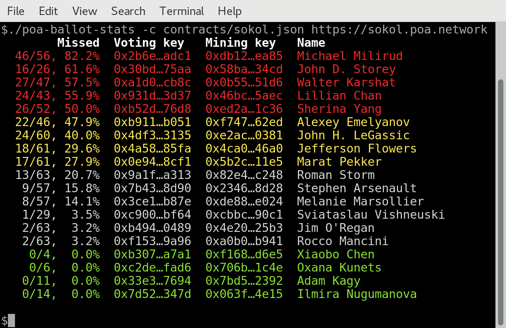

# POA ballot stats

A command line tool that displays voting statistics for the [POA network](https://poa.network/).
It requires a recent version of [Rust](https://www.rust-lang.org/), and needs to communicate with a
fully synchronized node that is connected to the network:
[POA installation](https://github.com/poanetwork/wiki/wiki/POA-Installation).
Note that `poa-ballot-stats` needs access to the network's full logs, so the node must run with
`--pruning=archive --no-warp`. 
Initial requirements for the tool described in RFC9 "Statistics of ballots." https://github.com/poanetwork/RFC/issues/9

You can view the command line options with `-h`, and specify a different endpoint if your node e.g.
uses a non-standard port. By default, it tries to connect to a local node `http://127.0.0.1:8545`.
In verbose mode, with `-v`, the complete list of collected events is displayed.

The `-c` option takes a map with the POA contracts' addresses in JSON format. You can find the 
current maps for the main and test network the `contracts` folder. By default, it uses `core.json`,
for the main network.

Examples:

```bash
$ cargo run -- -h
$ cargo run
$ cargo run -- -c contracts/sokol.json https://sokol.poa.network -v
```

## Screenshot


