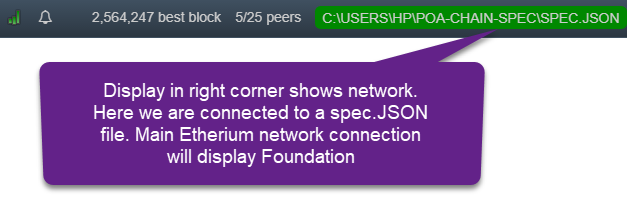

# POA ballot stats

  [](https://travis-ci.org/poanetwork/poa-ballot-stats) 

POA ballot stats is a command line tool used to display voting statistics for the [POA network](https://poa.network/). 

[Validators](https://github.com/poanetwork/wiki/wiki/Role-of-Validator) on the network engage in active governance, managing their roles and creating on-chain consensus. This is achieved through a balloting process. 

Ballot tracking provides transparency for POA token holders and promotes validator accountability. The poa-ballot-stats tool displays active validator voting participation ordered by percentage of missed votes. 

The default display includes:
* non-participation/associated ballots
* missed %
* truncated voting key
* truncated mining key
* first name last name


## Dependencies
Prior to downloading poa-ballot-stats, install and activate a fully synchronized node connected to the POA network. See the [POA installation guide](https://github.com/poanetwork/wiki/wiki/POA-Installation) for instructions.

**Note:** poa-ballot-stats must access the full network logs. Use these flags when running a node: `--pruning=archive --no-warp`

**Example:**
```bash
$ parity --chain poa-chain-spec/spec.json --reserved-peers poa-chain-spec/bootnodes.txt --pruning=archive --no-warp
```

## Installation

### Stable Release

Download the archive for your platform from the latest [release](https://github.com/poanetwork/poa-ballot-stats/releases) and unpack. Run the tool with `./poa-ballot-stats <options>`.

#### Options

`-h, --help` view command line options and help information. 

`<url>` specify a different endpoint if your node uses a non-standard port. The default connects to a local node `http://127.0.0.1:8545`.

`-V, --version` prints version information.

`-v, --verbose` display collected ballot and key change events and the list of participating and abstaining voters for each ballot.

`-c, --contracts <contracts>`  append a map file with POA contract addresses in JSON format. The current maps for the main and test network are in the `contracts` folder. Default is the main network `core.json` file.

`-p, --period <period>`  a time interval in hours, days, months, etc. For example, `-p "10 weeks"` only counts participation in ballots created within the last 10 weeks. 

`-b, --block` takes the earliest block _number_ as a decimal option. For example, `-b 524647` counts participation from block number 524647 onward.


**Examples:**

```bash
$ ./poa-ballot-stats
$ ./poa-ballot-stats -h
$ ./poa-ballot-stats https://core.poa.network -v -p "10 weeks"
$ ./poa-ballot-stats -c contracts/sokol.json https://sokol.poa.network -v
```

### Latest code

If you have a recent version of [Rust](https://www.rust-lang.org/), you can clone this repository and use `cargo run --` instead of `./poa-ballot-stats` to compile and run the latest version of the code.

## Troubleshooting

### No Events Found error

1.	Parity must be fully synced to the correct node and running in full mode, not "light" mode. Check Parity UI and/or Task Manager to confirm Parity is synced and actively connected to peers.

2.	`poa-ballot-stats` must run with a file matching the Parity network node. Use the contracts address file (`-c` option) that matches the network connection. Included are files for the main POA network ("core") and the POA test network ("sokol"). The Parity UI will show the current network selection in green. Make sure this is the correct network, and not the Foundation or other Ethereum network. 



## Versioning

We use [SemVer](http://semver.org/) for versioning. See the [project releases](https://github.com/poanetwork/poa-ballot-stats/releases/) and the [changelog](CHANGELOG.md) for historical changes.

## Contributing

Please read [CONTRIBUTING.md](CONTRIBUTING.md) for contribution and pull request protocol.

Future implementations may include the number of yes/no votes for each validator and other data points. Proposed requirements and notes on this issue are described in RFC9 [Statistics of ballots](https://github.com/poanetwork/RFC/issues/9).

## License

This project is licensed under the GNU Lesser General Public License [](https://www.gnu.org/licenses/lgpl-3.0). See the [LICENSE](LICENSE) file for details.